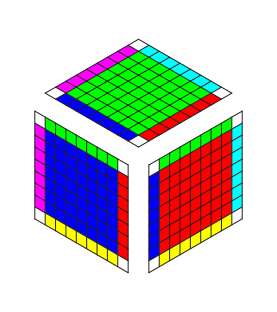
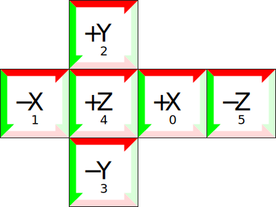

# Cube Mapping and Cube Map Border Generation

A *cube map* gives a panoramic image covering every possible view direction from top to bottom and all the way around. It does so using six separate square images that are aligned with the six faces of a cube, from whence comes the name.

Cube maps are a valuable tool for real time rendering. They provide a very efficient representation of [environment maps for reflective and refractive materials](), and of [irradiance maps for diffuse materials]() under complex lighting. They make [sky dome]() rendering trivial, and give an elegantly uniform representation of any spherical data [free from distortion at the poles](). Cube map textures meet all these needs by straightforwardly exploiting common 2D raster sampling mechanisms that are highly optimized by many generations of graphics hardware.

However, using cube maps correctly can be challenging. I'm writing this in 2013, and despite the passage of *fourteen years* since the publication of the [ARB specification for cube map textures](http://www.opengl.org/registry/specs/ARB/texture_cube_map.txt), hardware and driver support for cube maps vary. Many implementations diverge from the basic cube map specification in one way or another, and support for enhanced cube mapping extensions is spotty. While dedicated GPUs provide generally mature cube map capability, integrated GPUs omit or simplify details to minimize cost and power consumption. Still-evolving mobile platforms represent an even lower low-end where conformance is even more fragmentary.

Incorrect cube map rendering results in the appearance of cracks or seams along the edges between images.

The fundamental problem

Enumerate some solutions.

The most flexible solution: bordering

Generating borders

To generate the borders correctly, we need to be extremely specific about the orientation of each of the cube's faces. This orientation was introduced to the graphics world by Ned Green in a 1986 CG&A paper entitled ["Environment Mapping and Other Applications of World Projections](http://dx.doi.org/10.1109/MCG.1986.276658). It was embraced by OpenGL in the [ARB cube map extension](http://www.opengl.org/registry/specs/ARB/texture_cube_map.txt) and appears today in the core [OpenGL specification](http://www.opengl.org/registry/).

Conceptually, a cube map may represent either an image of an environment as viewed from inside, or a map on the surface of a sphere as viewed from outside. It is therefore ambiguous to refer to any of the six images as "left" or "right" or "front" or "back". Instead we name them unambiguously after the axis along which each appears.

The +X, -X, +Z, and -Z images appear upright and aligned with one another. The +Y and -Y images are quite arbitrarily selected to align with +Z, which determines their orientation and ultimately codifies the mathematical mapping from direction to texel.

