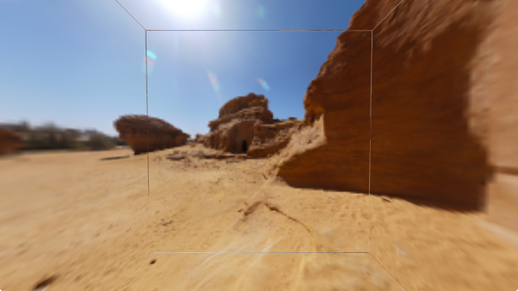

# Cube Mapping and Cube Map Border Generation

A *cube map* gives a panoramic image covering every possible view direction from top to bottom and all the way around. It does so using six separate square images that are aligned with the six faces of a cube, from whence comes the name.

Cube maps are a valuable tool for real time rendering. They provide a very efficient representation of [environment maps for reflective and refractive materials](), and of [irradiance maps for diffuse materials]() under complex lighting. They make [sky dome]() rendering trivial, and give an elegantly uniform representation of any spherical data that is[free from distortion at the poles](). Cube map textures meet all these needs by straightforwardly exploiting common 2D raster sampling mechanisms that are highly optimized by all graphics hardware.

Unfortunately, using cube maps correctly can be challenging. I'm writing this in 2013, and despite the passage of *fourteen years* since the publication of the [OpenGL ARB specification for cube map textures](http://www.opengl.org/registry/specs/ARB/texture_cube_map.txt), hardware and driver support for cube maps vary in quality. Many implementations diverge from the basic cube map specification, and support for enhanced cube mapping extensions is spotty. While dedicated GPUs provide generally mature cube map capability, integrated GPUs omit or simplify details to minimize cost and power consumption. Still-evolving mobile platforms represent an even lower low-end where conformance is even more fragmentary.

## Edge seams

Incorrect cube map rendering results in the appearance of cracks or seams along the edges between images. Even with a correct implementation, the default state of OpenGL is incorrect for cube mapping. As seen here, the outline of the cube is quite objectionable.

In truth, that's a beginner's error, but it's one that just about everyone makes initially. The beginner's fix is straightforward: set the texture object wrap mode to `CLAMP_TO_EDGE`.

    glBindTexture  (GL_TEXTURE_CUBE_MAP, cubemap);
    glTexParameteri(GL_TEXTURE_CUBE_MAP, GL_TEXTURE_WRAP_S, GL_CLAMP_TO_EDGE);
    glTexParameteri(GL_TEXTURE_CUBE_MAP, GL_TEXTURE_WRAP_T, GL_CLAMP_TO_EDGE);
    glTexParameteri(GL_TEXTURE_CUBE_MAP, GL_TEXTURE_WRAP_R, GL_CLAMP_TO_EDGE);

The problem appears to be resolved.

However, looking closely, we can see that it's not. There's still something funny going on there.

Most applications aren't going to look this closely at a high-resolution cube map. However, low-resolution cubemaps are very commonly used to represent low-frequency diffuse and specular illumination environments. In these cases, the `CLAMP_TO_EDGE` fix isn't good enough.

## Why this happens

The fundamental problem

## Several solutions

Enumerate some solutions.

The most flexible solution: bordering

## Generating borders

To generate the borders correctly, we need to be extremely specific about the orientation of each of the cube's faces. This orientation was introduced to the graphics world by Ned Green in a 1986 CG&A paper entitled ["Environment Mapping and Other Applications of World Projections](http://dx.doi.org/10.1109/MCG.1986.276658). It was embraced by OpenGL in the [ARB cube map extension](http://www.opengl.org/registry/specs/ARB/texture_cube_map.txt) and appears today in the core [OpenGL specification](http://www.opengl.org/registry/).

Conceptually, a cube map may represent either an image of an environment as viewed from inside, or a map on the surface of a sphere as viewed from outside. It is therefore ambiguous to refer to any of the six images as "left" or "right" or "front" or "back". Instead we name them unambiguously after the axis along which each appears.

The +X, -X, +Z, and -Z images appear upright and aligned with one another, which is natural in common use cases. The +Y and -Y images are quite arbitrarily selected to align with +Z, which determines their orientation and ultimately codifies the mathematical mapping from texture coordinate to texture value. As we're dealing with multiple images, a well-defined image structure requires an ordering. OpenGL enumerates the faces in the order +X, -X, +Y, -Y, +Z, -Z and we assign indices to these from zero to five.
