# Image Deconvolution with GIGO

Copyright &copy; 2012&ndash;2013 [Robert Kooima](http://kooima.net).

[GIGO][] is set of command-line image processing utilities. GIGO's reason for being is the enablement of image processing tasks on very large images, consisting of hundreds of billions or even trillions of pixels, that choke most image editing tools. GIGO's complimentary goal is the enablement of *frequency domain* operations at all scales, which the majority of image editing tools don't even touch. This document introduces the frequency domain and demonstrates *deconvolution*, one of many image processing tasks that can be accomplished only through frequency domain processing. The motivation for this example was found at large on the web...

## Background

In November of 2011 a [question][] was posed to [Ask Metafilter][askme] seeking help in interpreting a blury photograph of the number plate on a passing truck. The posting user, "[gentle][]" from Oslo, was tight-lipped about why this information was needed, but helpful-as-ever AskMe went to work anyway. Eventually, a user named "[trevyn][]" of San Francisco would [answer][] the question in spectacular fashion, having applied [Mathematica][]'s image deconvolution capabilities to determine the number beyond any shadow of a doubt.

In this example, we'll use GIGO to reproduce trevyn's result and read the plate. [This][original] is the original image. As of this writing, the question, the answer, the image, and its decovolution all remain publicly accessible on Ask Metafilter. gentle's question has 36 favorites and trevyn's answer has 302 (which is a lot), with many subsequent posters astonished at the capability of image deconvolution. Many people learned what deconvolution was that day, and the thread is a great piece of AskMe. However, gentle never did follow up as to the reason for the question or the utility of the answer. For all I know, it may be sensitive. I am rehosting the original image here, and if gentle has a problem then he may contact me to remove it.

[gigo]:        http://kooima.net/applications.html#gigo
[askme]:       http://ask.metafilter.com/
[question]:    http://ask.metafilter.com/201542/Can-you-read-this-number-plate
[answer]:      http://ask.metafilter.com/201542/Can-you-read-this-number-plate#2902934
[gentle]:      http://www.metafilter.com/user/14169
[trevyn]:      http://www.metafilter.com/user/23824
[mathematica]: http://www.wolfram.com/mathematica/
[original]:    original.jpg

## Getting to the point

For starters, I cropped the image down to 512 &times; 256, which is power-of-two size, as required by GIGO. I made a point of *not* scaling the image so as to preserve the precise character of the noise in it, as I want to make the impact of noise upon deconvolution obvious. All images here are stored as 32-bit floating point TIFFs, converted to 8-bit PNG for display on the web. Here's the cropped input, which I'll call `license.tif`. Click this or any other PNG to download the original TIFF.

[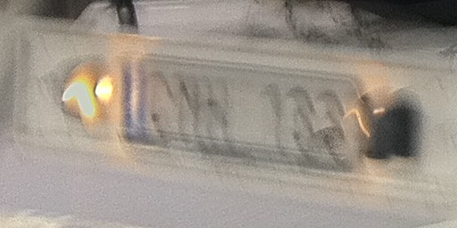](license.tif)

Initial Ask Metafilter responders had varied inputs as to the interpretation of this image: RNN 133, DNH 133, 123, QNN, 188, QNH, PNH, 163, CNM 733, PNW, DMR, 155, it was all over the map. But here's the unprocessed image after deconvolution.

[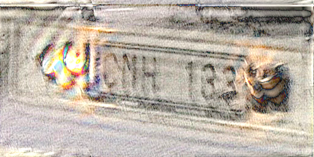](license-wiener-0-01.tif)

It's still a mess, but the numbers are quite clearly legible: CMH 133.

We can do a bit better by denoising the original input image. This is a perfectly reasonable thing to do, as the noise characteristics of digital cameras are well-understood by the image enhancement algorithms provided by common photo processing applications. Here, I've used Photoshop to adjust the contrast, reduce the noise, and save a copy as `license-denoised.tif`.

[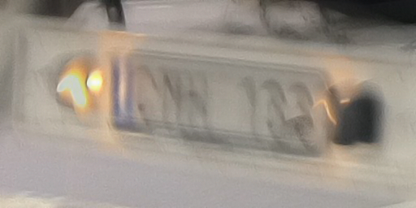](license-denoised.tif)

This input is not significantly more legibile than the source input, but here's where deconvolution takes us.

[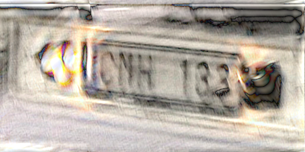](license-denoised-wiener-0-05.tif)

## The Blur

Look closely at the input image. To the right of the number plate there is a little orange smudge. This is the blur of a small lightsource, probably a hole in the shroud covering the lamp that illuminates the number plate. This blur has a clear shape that indicates the motion of the photographer's hand during the 1/24th of a second that the shutter was open. Every pixel in this image has been impacted by this same motion, and it's the reason why the number plate is not clearly legible. To read the number plate, we must undo this motion.

Here is the isolated path, which we call the *blur kernel*, `blur.tif`. I've converted it to gray because, despite the fact that the path appears orange in the input, all three channels red, green, and blue underwent the same blur during exposure, and we want them all to receive the same correction.

[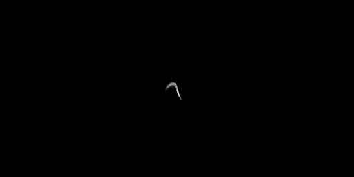](blur.tif)

## Convolution and Deconvolution

Blur is *convolution*. It is a circumstance where pixels bleed into their neighbors, resulting in distortion. Out-of-focus lenses cause blur, fast motion causes blur, and even Photoshop does blur as a feature. In the photograph of the number plate, every pixel in the image has been distorted by its neighboring pixels, and `blur.tif` tells us which neighbors are at fault.

The number plate image is what we call a *spatial domain* image. It's a 2D representation depicting common 3D objects positioned normally in space. There exists an alternate image representation known as the *frequency domain* which is a 2D representation depicting the distribution of energy in an image. Each of these domains has unique advantages, and we can freely transform an image back and forth between the spatial and frequency domains using the 2D Fourier transform, and its inverse.

In the frequency domain, convolution, and therefore blur, is equivalent to simple multiplication. This is one of the fundamental tenets of signal processing, and is not intuitive in the least. Lets take it on faith for now.

Say we somehow had a perfectly unblurred photograph of the number plate. We could calculate the Fourier transform of that image and the Fourier transform of `blur.tif` giving both images in the frequency domain. If we multiply these two frequency domain images pixel-by-pixel, we calculate their convolution. If we then compute the inverse Fourier transform of this result, we would receive `license.tif`, the blurry image that gentle posted to Ask Metafilter.

Of course, we don't want `license.tif` because we already have it. We want to perform this process in reverse to receive the unblurred photo. Fortunately, the reverse of multiplication is simply division. Dividing the frequency domain images should lead us to the solution...

## Fourier Transform

We first calculate the Fourier transform of the number plate. As an out-of-core process, GIGO works strictly with image data in a tiled, complex-valued, disk-based cache. The calculation therefore begins with a conversion from TIFF to binary, with a page size of 25 (see the GIGO documentation for more information.) Following this, a 2D Fourier transform is applied as a pair of 1D Fourier transforms, with the second of the two done in transpose. Finally, the resulting binary cache is converted back to TIFF so we can view it.

    convert -l5 license.tif license.bin
    fourier -l5 license.bin
    fourier -l5 -T license.bin
    convert -l5 license.bin license-fourier.tif

Here are the frequency domain amplitude channels of `license-fourier.tif`. GIGO will output six total channels, three of amplitude and three of phase, but the amplitude is really the more interesting because it shows us the energy in the input.

[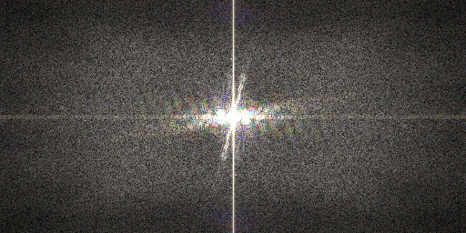](license-fourier.tif)

Functionally speaking, it's more-or-less impossible to infer much about the input image from the appearance of its Fourier transform. In this case, the vertical and horizontal lines through the center of the image imply that source does not tile seamlessly. The prominent diagonal spike indicates the presence of strong edges in the input perpenticular to the spike, which correspond to the rear bumper of the truck. The rest is noise.

The blur kernel must also be transformed into the frequency domain. However, if our goal is to make a round trip from spatial domain, to frequency domain, and back to spatial domain, then any convolution kernel that we apply in the frequency domain must have *unit energy*. That is, all of its pixels summed together must equal one, and if that's not the case then the output image will not have the same brightness as the input.

To make the sum equal one, we must first determine the initial sum of the blur kernel pixels. We convert the image to GIGO's cache form, and measure it.

    convert -l5 blur.tif blur.bin
    measure -l5 -s blur.bin

Because the input was converted to grayscale, the sum of all three channels is the same. There are roughly 34 illuminated pixels in the blur image.

    34.530952
    34.530952
    34.530952

To *normalize* the blur kernel, we must scale the image by 1 / 34.530952 = 0.0289595. This corresponds to trevyn's use of Mathematica's `ImageMultiply` function with a value of 0.03, as noted in his reply.

    compute -l5 -s 0.0289595 blur.bin

Now we compute the Fourier transform of the kernel.

    fourier -l5 blur.bin
    fourier -l5 -T blur.bin
    convert -l5 blur.bin blur-fourier.tif

The resulting frequency-domain amplitudes look like this.  Again, there's not much to interpret visually here, except that there's not much information in `blur.tif` so the density of `blur-fourier.tif` is low.

[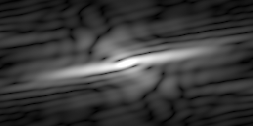](blur-fourier.tif)

## Naive Deconvolution

If frequency domain convolution is multiplication and deconvolution is division, then  we should be able to extract the unblurred image from `license.tif` by dividing in the frequency domain. To try it, compute the division as follows

    cp license.bin license-divide.bin
    compute -l5 -D license-divide.bin shake.bin

Then convert the frequency domain division to the spatial domain using the inverse Fourier transform.

    fourier -l5 -I license-divide.bin
    fourier -l5 -IT license-divide.bin
    convert -l5 license-divide.bin license-divide.tif

Unfortunately, gentle's iPhone 4 has a pinhole lens and a tiny sensor and the resulting image noise is amplified by the division in the frequency domain, giving this:

[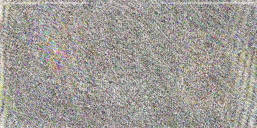](license-divide.tif)

That's not good. Looking again at `blur-fourier.tif`, above, note that there are areas of black. These are low-energy spectra in the blur kernel. Black is represented by very small values, and dividing by a very small value results in a very large value. The resulting high-energy spectra overpower the relatively low-energy signal that the deconvolution has produced, and the final spatial-domain image is useless.

## Weiner Deconvolution

Fortunately, there's a solution in what's known as [Wiener deconvolution][wiener], a reformulation of the division operation to ensure that the result remains stable in the presense of small values in the frequency domain representation of the blur kernel. This reformulation provides a parameter that allows us to balance noise against deblurring. There are ways of choosing a good value for this parameter, but to keep it simple we'll go with trial and error.

[wiener]: http://en.wikipedia.org/wiki/Wiener_deconvolution

Let's try a Wiener deconvolution with a parameter of 0.5 and do an inverse Fourier transform on the result.

    cp license.bin license-wiener.bin
    compute -l5 -w0.5 license-wiener.bin shake.bin
    fourier -l5 -I license-wiener.bin
    fourier -l5 -IT license-wiener.bin
    convert -l5 license-wiener.bin license-wiener-0-5.tif

Here's the output:

[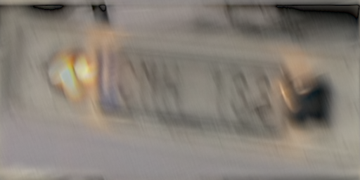](license-wiener-0-5.tif)

The noise has been reduced, but the image isn't any more clear. Here it is at 0.1:

[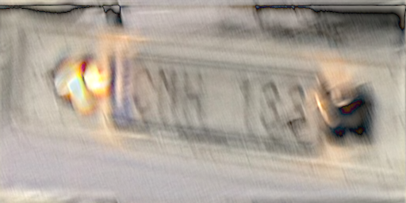](license-wiener-0-1.tif)

It's more legible, but still a bit blurry. Let's go a little further, to 0.05:

[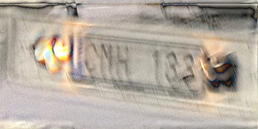](license-wiener-0-05.tif)

Now we've got some sharpness in the lettering. That's good. The noise has returned, but again, we're trying to strike a balance. Let's keep reducing the Wiener parameter, this time to 0.01.

Well that's excellent sharpness in the number plate, but the noise is a little much. Just for the hell of it, lets see what happens if we keep going... 0.001.

[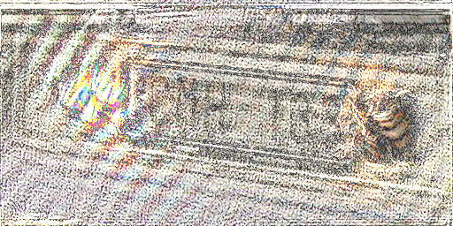](license-wiener-0-001.tif)

That's too far. Any further and it's going to resemble the useless output of the division operator. Indeed, that's what the Wiener parameter does: it allows for a point to be selected somewhere between the completely untouched image and the completely destroyed image. I think 0.05 strikes a good balance, and that's the value used to produce the output shown at the start of this example.

## Conclusions

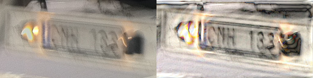

Why isn't the best output even better? Why, for example, has the little orange smudge *not* been collapsed back down to a single orange dot through the marvelous process of image deconvolution? Fundamentally, because my blur kernel is imperfect. It's too wide, it has holes... it's the result of 5 minutes of fiddling with levels in Photoshop. But even if I had labored to produce an ideal extraction of the orange smudge, this still wouldn't take into account every single factor that impacted the quality of the exposure. We would need to know everything about the camera, the lens, and the sensor noise, and we'd also need a perfect understanding of the motion of both vehicles and the photographer. It's impossible, and fortunately for gentle, it's not necessary.

Perfect image deconvolution *is* possible under artificial conditions. Create an arbitrary blur kernel using your favorate image editor and convolve it with an image by computing the frequency domain multiplication. Take a moment to appreciate your beautifully screwed-up image. Then deconvolve that same image by computing the frequency domain division. You will get the original image back, with mathematical equality. This proves the point. Regardless, this simple, imperfect number plate example is probably already closer to [CSI-grade fantasy](http://www.youtube.com/watch?v=Vxq9yj2pVWk) than you may have thought possible.
