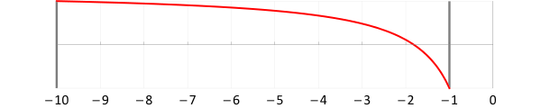
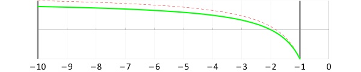
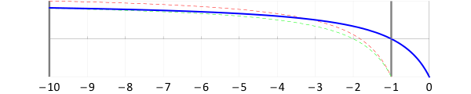
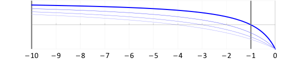

# Median Distance Perspective Projection

Copyright &copy; 2008&ndash;2013 &mdash; [Robert Kooima](http://kooima.net)

## Introduction

Careful OpenGL applications attempt to make the most of the available resolution of the depth buffer by tuning the near and far clipping planes to closely bound the visible scene. For many applications, this is either difficult to do correctly, or expensive.

A mis-tuned near clipping plane can result in mis-drawn geometry near the viewpoint, usually permitting the viewer to see into nearby objects. Consequently, developers often feel a desire to pull the near clipping plane as far as possible toward the viewpoint. But of critical importance is the ratio of the far to near distances, and unless a corresponding adjustment is made to the far clipping plane, depth buffer precision is wasted. If the near distance is set to zero then the standard perspective projection is undefined.

This article discusses a means to reduce the problems of near clipping distance and depth buffer precision by foregoing the usual near and far distance specifications and reformulating the perspective projection transformation in terms of the *median* of the scene. The result is a short GLSL vertex function that allows geometry to be transformed and rasterized arbitrarily close to the viewpoint, while maintaining an affordance needed by applications to influence depth buffer utilization.

Of course, this technique introduces problems of its own, and is not a universal solution. It is instead an exploration in the elimination of perspective clipping planes, with an easy means by which the programmer may investigate on his own.

## Background

### Definitions

Coordinate transformation is defined in section 2.11 of the [OpenGL Specification](http://www.opengl.org/documentation/specs/). First, a homogeneous position in object space is transformed by the model-view matrix, giving a position in eye space, a coordinate system with the viewpoint at the origin, looking down the negative *z* axis.

Then, the eye space position is transformed by the projection matrix, giving a position in clip space, a coordinate system centered at the origin and bounded by the homogeneous unit cube.

Finally, the homogeneous divide is performed, giving a position in normalized device coordinates.

Normalized device coordinates are linearly biased and offset by the current viewport and depth range for use during rasterization. The model-view and projection transforms may be handled by a vertex program, but the homogeneous divide and viewport transform occur after vertex processing and before fragment processing, outside of the control of either.

The standard OpenGL perspective projection *P* is defined in terms of 6 parameters: the distances to the near and far clipping planes, and the left, right, bottom, and top extents of the view frustum at the near plane. These parameters are labeled *n*, *f*, *l*, *r*, *b*, and *t*, respectively. The transformation matrix is

### Interpretation

When considering the impact of the near and far plane distances on depth, we are most interested in the behavior of the depth value *zd* as eye distance *ze* varies. Expanding the above definition gives

+2fn}{z_e(f-n)}")

The following is a graph of *zd* using an example perspective projection where *n* = 1 and *f* = 10. We see that the normalized depth varies over the expected range &plusmn;1 as the eye distance varies over the specified domain from near to far. We also clearly see the non-linear behavior of device depth. The effective resolution of the depth buffer is concentrated near the viewpoint, where it matters most.

## Eliminating the far clipping plane

Several researchers have noted the value and ease of eliminating the far clipping plane. Examples include Cass Everitt and Mark Kilgard's [2002 paper](http://developer.nvidia.com/object/robust_shadow_volumes.html) on shadow volumes, and Eric Lengyel's [Gamasutra feature](http://www.gamasutra.com/features/20021011/lengyel_01.htm) on the same topic. The approach involves evaluating the perspective transform matrix *P* in the limit as the far clipping distance *f* approaches infinity. The resulting transformation matrix is largely the same, with the exception of 2 elements at the lower-right, which determine the interaction of *z* and *w*.

Under these circumstances, the behavior of *zd* with respect to *ze* is simplified.

Here we see this graphed in green, again with *n*=1, overlaid on the standard behavior in red, for comparison. The normalized depth no longer reaches its maximum range at any specific far clipping distance. Instead, it asymptotically approaches 1 as *ze* approaches negative infinity. This graph also makes apparent the cost of this modified projection in terms of lost depth buffer precision near the viewpoint. As most researchers assert, the cost is real, but not significant.

## Eliminating the near clipping plane

Both the standard and infinite projections map the bottom of the depth buffer onto a non-zero near clipping distance. We would instead like to map the bottom of the depth buffer onto zero. Toward this end, we work backwards and begin with a formulation of *zd* that behaves as desired.

Here we see the behavior of this function graphed in blue, overlaid on the standard in red, and the infinite perspective in green. It behaves much like the infinite perspective, but is shifted to intersect its minimum range &minus;1 at zero, rather than at any specific near clipping distance.

Note that with neither near nor far parameters affecting normalized depth, we've lost the affordance that enables the tuning of depth buffer utilization. So, define a median parameter *m* that determines where *zd* = 0. As is apparent in the above graphs, the zero crossing gives the location of the effective middle of the depth buffer. Half of the resolution of the depth buffer is applied to the positive normalized depth range, and the other half is applied to the negative depth range. So now,

The following graph shows the behavior of normalized depth under median distances of 1, 2, 3, and 4. Clearly, the median parameter *m* has the effect of stretching the graph and expanding the effective range of the depth buffer out into the scene. As such, it affords the same level of control that the near distance provided to the standard and infinite projections.

At first glance, the definition of a projection matrix producing this effect seems straightforward. The following is a first attempt. Note that a near distance parameter *n* remains in the *x* and *y* scaling positions. This is necessary because the near value, along with the left, right, top, and bottom view frustum extents, defines the aspect ratio and field of view of the projection. However, in this circumstance it no longer clips or affects the mapping of *ze*.

This projection does indeed produce the desired effect in *z*. However, *x* and *y* receive the same homogeneous divisor, and the effect on them is

\cdot z_e}{(r-l)\cdot\textcolor{red}{(-z_e+m)}}\qquad y'_d=\frac{2n\cdot y_e+(t+b)\cdot z_e}{(t-b)\cdot\textcolor{red}{(-z_e+m)}}")

That &minus;*ze* + *m* in the denominator causes a host of problems during the application of the viewport transformation. The edges of viewport no longer map correctly onto the edges of the view frustum. We need it to behave more like this:

\cdot z_e}{(r-l)\cdot\textcolor{red}{(-z_e)}}\qquad y'_d=\frac{2n\cdot y_e+(t+b)\cdot z_e}{(t-b)\cdot\textcolor{red}{(-z_e)}}")

The solution is simple, but somewhat of a tricky hack. We apply the desired &minus;*ze* homogeneous divisor explicitly, and pre-multiply the erroneous &minus;*ze* + *m* divisor in the numerator. This way, when the homogeneous divide occurs, it has the effect of eliminating the error rather than introducing it.

}{-z_e}\qquad y_d=\frac{y'_d\cdot(-z_e+m)}{-z_e}")

## Implementation

The median-depth perspective projection is implemented as a drop-in replacement for the GLSL `ftransform` function used in the vertex program. It uses the existing OpenGL projection matrix in order to leverage standard functionality in setting the field-of-view, aspect ratio, and off-axis skew. This allows applications to continue to use existing calls to `glFrustum` or `gluPerspective` for view control. Note, however, that the near and far distances passed to these functions will no longer have any effect on depth mapping.

Applications should set the `median` uniform to an appropriate value, usually the distance to the center of the scene to be viewed.

    uniform float median;

    vec4 ftransform_mdp()
    {
        vec4 clip, eye = gl_ModelViewMatrix * gl_Vertex;

        clip.xy = -(gl_ProjectionMatrix * eye).xy * (-eye.z + median) / eye.z;
        clip.z  = -eye.z - median;
        clip.w  = -eye.z + median;

        return clip;
    }

    void main()
    {
        gl_Position = ftransform_mdp();
    }

## Caveat

In practice, the near clipping plane has a two-fold purpose. It defines the start of the depth buffer, but it also protects eye-space geometry from the singularity in the perspective projection at zero. It should be clear from the equations and code above that the potential exists for a division by zero when *ze* is zero. If this occurs, *xd* and *yd* will be undefined, degenerate geometry will be emitted, and pathological rasterization may occur.

Applications that use this technique should take care not to allow the viewpoint to pass into surfaces, or should at least not expect sane results when it does happen. In such cases, problematic geometry should be culled from the view. Unfortunately, this level of culling granularity is probably just as tricky as correctly tuning the clipping planes of the standard projection from the outset.

## So when is this useful?

Probably never. It breaks the rules of perspective projection and can present the rasterizer with input that it was not designed to handle. However, it's something many 3D programmers (especially beginners) would like to try to do, even if only to learn first-hand how it fails. Try it out in your application if you are so inclined. You may find it works surprisingly well, but you should not expect a panacaea.
