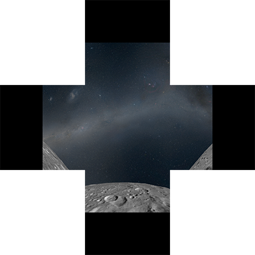

# Real-time Digital Dome Rendering

> *This article was written in 2008 as a primer on real-time rendering for the International Planetarium Society. At that time, I was a graduate student working with the Space Visualization Lab at the Adler Planetarium in Chicago. The field of real-time dome rendering has since evolved to meet our predictions and to largely satisfy our motivations. However, the technical information presented here is still relevant. A few of the images have been updated.*

Copyright 2008 &mdash; [Robert Kooima](http://kooima.net), Doug Roberts, Mark SubbaRao

Multi-projector digital dome systems are becoming commonplace, but real-time software to drive them is not. The majority of digital dome content is pre-rendered, and existing real-time software is largely proprietary and expensive.

Real-time visualization is a valued goal as it enables a live planetarium show, an adaptive and interactive visitor experience, and rapid content creation. Additionally, real-time systems reduce the cost and complexity of back-end storage and distribution of pre-rendered video.

Driving planetarium domes in real-time is feasible today. The video game industry has driven commodity graphics hardware capability to incredible levels at affordable prices, and this trend will continue for the foreseeable future. Complex visualizations once possible only after off-line rendering can today be generated at interactive rates. A complete system with this capability costs only a few thousand dollars using off-the-shelf hardware.

However, the freely available software, knowledge, and experience to support this hardware capacity has yet to catch up. In a continuing effort to exploit opportunities enabled by powerful, new hardware, the staff of the Space Visualization Laboratory at the Adler Planetarium and Astronomy Museum has installed an inexpensive cluster of off-the-shelf PCs in Adler's full-dome theater. With this installation, we are working to implement solutions to the general problems of real-time multi-projector digital dome display, and to make them freely available as Open Source software. We hope we can encourage and assist others in the creation of new dome software and in the adaptation of existing visualizations to dome display.

Toward this end, this document discusses techniques for real-time dome rendering. We enumerate a number of solutions to its two major challenges: spherical correction and edge blending. Noting the broad range of hardware in use today, we review the evolution of technology that made each technique possible.

## Background

To render a real-time application to a dome display, we must quantify the dome's configuration. We assume one or more projectors filling the surface of the dome. Each projector is connected to one of the video outputs of a PC host, or cluster of hosts interconnected by a network. Along with the dome radius, we require the precise position and orientation of each projector relative to the dome, as well as the field-of-view of each projector. Finally, we need some knowledge of how the projector images overlap and how they are to be trimmed and blended with one another to obscure the seams between them.

### Real-time 3D Graphics

To make this discussion broadly accessible, let's review the fundamentals of real-time 3D graphics. 3D rendering begins with simple verticel in 3D space. Vertices are connected to form triangles. These triangles are rasterized into individual pixels on the screen.

All real-time 3D graphics are composed of these few basic building blocks. While some rendered objects---stars, clouds, or galaxies---appear complex, these vertices and triangles can always be found underlying them.

This image shows the logical structure of a real-time graphics processing unit (GPU). An application enumerates vertices in 3D space. The Vertex Processing stage computes lighting values and screen positions for each. The Geometry Processing stage connects these vertices into triangular geometric primitives. The Primitive Rasterization stage breaks each primitive into fragments (a.k.a pixels). Fragment Processing combines each fragment with a 2D image describing its color and texture. Finally, fragments are written to the frame buffer in video RAM (VRAM) and appear on-screen.

### OpenGL

GPU functionality is exposed by an application programming interface (API). [OpenGL](http://www.opengl.org/) is the most widely used of these. While its competitor, Microsoft's Direct3D, sees wider usage in PC and XBox-based game development, OpenGL is the only cross-platform graphics API available. Introduced in 1992, it sees widespread use not only in gaming, but in computer-aided design, scientific visualization, and digital content creation across Windows, Linux, and Mac OS X.

The API specification is defined by the OpenGL Architecture Review Board (ARB) Working Group. As graphics hardware evolves, the ARB extends and revises the API.

The most significant change seen in nearly [400 extensions](http://www.opengl.org/documentation/extensions/), 9 major revisions, and 16 years since the introduction of OpenGL has been the evolution from fixed functionality toward programmable functionality. Refer again to the image of the pipeline, above. The vertex, geometry, and fragment processing segments were once fixed hardware units, their functionality firmly etched in silicon logic. Today, the these are accessible as general purpose processing units, programmable like a CPU.

The [OpenGL Shading Language](http://www.opengl.org/documentation/glsl/) (GLSL) is the ARB standard language for GPU programming. It allows the application developer to customize the action performed by the hardware. Program code written in GLSL is compiled by the video driver and uploaded to the GPU, to serve as one of the three functional elements: vertex, geometry, or fragment processing.

This capability exposed incredible flexibility and initiated a fundamental shift in the design of real-time 3D algorithms. The programmable pipeline proves especially useful in the realm of real-time dome rendering, as it allows the computational load of spherical correction and edge blending to be offloaded from the CPU to the GPU.

## Spherical Correction

Real-time rendering is fundamentally linear. Perspective projection and rasterization assume that the display is flat. A straight line connecting 2 points in 3D space is rasterized as a straight line of pixels in the 2D frame buffer.

Unfortunately, when projecting an image onto a curved surface, this linear invariance can no longer be relied upon. A straight line appears straight only when viewed from the point of projection. In the most general case, both the point of projection and the desired point of view may be positioned anywhere in the dome. If one or both of these do not lie at the center of the dome, then a correction must be made.

The process of correcting a single point is relatively intuitive. Imagine that the dome is positioned within the scene to be rendered. With the view point at *V*, the image of point *A* falls on the dome at *I*. But when displayed by a projector positioned at *P*, a point projected onto the dome at *I* must instead be drawn at *B*. The challenge lies in expressing this in terms of the operations exposed by OpenGL. 

There are a number of approaches to this problem, each with different strengths and weaknesses. As with all real-time graphics algorithms, these approaches have evolved alongside the hardware that enabled them.

### Vertex correction

The simplest means of spherical correction happens on the CPU. As the application submits each vertex to the GPU, it pre-distorts the vertex position as shown in the following image. The application must cast a ray from the view point to the scene vertex, and intersect the ray with the surface of the dome. It then determines where that intersection point falls within the field of view of each projector, and submits that point to the GPU for rendering.

This approach is expensive, as each vertex needs to be reprocessed with each change in the scene. Not only does this incur CPU load, it consumes the bandwidth of the graphics bus, the communication channel by which the CPU and GPU communicate.

However, this approach received a significant boost in 2001 with the release of the NVIDIA GeForce 3, the first hardware capable of [programmable vertex processing](http://www.opengl.org/registry/specs/NV/vertex_program.txt). Vertex programming allowed the correction to be performed by the GPU, freeing the application to submit its geometry normally, and even to preload static geometry into VRAM. This author applied the technique to the point-based display of fluid flows on an Elumens VisionDome V4. A real-time motion-tracked view point and active stereo projection led to a deeply immersive virtual reality experience.

The flaw in this approach is that the correction is performed only at the vertices. Edges connecting these vertices are still linearly rasterized. So, this approach works well when rendering  points or finely tessellated models, but fails for large triangles and long lines.

### Primitive correction

Given spherically corrected vertices, further action can be taken to account for the errors that occur during rasterization. If the edge connecting two vertices is distorted, then the distortion will be greatest at the midpoint. Compute the distance between this midpoint and the spherically corrected midpoint. If the distance is large, then subdivide the edge by cutting the triangular primitive in half.

Recursively apply the same algorithm to the edges of these sub-primitives, and halt when the magnitude of the distortion is tolerable. The result will be a re-tessellation of the scene geometry, adapted to the dome and view position.

This was the approach taken by Elumens' SPI API in 2001. The SPI API intercepted all calls to the OpenGL API and performed the adaptive subdivision automatically. While it worked correctly, it performed badly, as the quantity of geometry tended to explode and overwhelm the GPU's vertex capacity.

In 2006 this approach received new life with the release of the NVIDIA GeForce 8800, the first hardware to expose [programmable geometry processing](http://www.opengl.org/registry/specs/NV/geometry_program4.txt). This allows the primitive subdivision process to be offloaded to the GPU, again freeing the application to manage its geometry normally and eliminating the performance bottleneck.

### Fragment correction

Common practice in dome rendering focuses on fragment-level spherical correction techniques. These approaches post-process the rendered image of the scene. The output of the scene-rendering first pass is used as the input to a spherical-correction second pass. In practice, this means that an output frame buffer must be converted to an input texture.

The history of OpenGL has seen a variety of techniques to accomplish this conversion. Early applications simply copied the pixel data in the frame buffer into the texture buffer. This approach suffered from poor performance due to the need to copy the image from the frame buffer memory of the GPU, to temporary storage in the main memory of the CPU, and finally to the texture memory back on the GPU. The solution to these performance woes would be the ability to render directly into a texture map. The [P-Buffer](http://www.opengl.org/registry/specs/ARB/wgl_pbuffer.txt) and [render-to-texture](http://www.opengl.org/registry/specs/ARB/wgl_render_texture.txt) specifications provided this capability in 2001, though differences between windowing APIs precluded cross-platform compatibility. After much deliberation, an OpenGL ARB working group finally approved the [frame buffer object specification](http://www.opengl.org/registry/specs/EXT/framebuffer_object.txt) in 2005, which continues to provide an optimal, cross-platform solution today in the form of the ARB's [official 2008 specification](http://www.opengl.org/registry/specs/ARB/framebuffer_object.txt).

#### Fixed-function Fragment Correction

The oldest and most common fragment-level spherical correction method predates the availability of the programmable pipeline. It relies only on the availability of cube map textures, a mechanism approved by the [ARB in 1999](http://www.opengl.org/registry/specs/ARB/texture_cube_map.txt) and widely supported by the hardware of that day, including SGI's high-end workstations and NVIDIA's consumer-grade GeForce 256.

A cube map texture consists of 6 square images corresponding to the 6 faces of a unit cube centered at the origin. While the pixels of a normal 2D texture are indexed using a 2D position (*u*, *v*), the pixels of a cube map are indexed using a 3D vector (*x*, *y*, *z*). This vector is cast from the origin and strikes the cube on one of its 6 sides. The intersection gives a 2D reference into one of the 6 images, which is then indexed normally.

If we logically embed the geometry of a dome within the volume of such a cube, as shown below, then the cube map lookup mechanism begins to resemble the reverse of the general approach to spherical correction.

We begin by rendering the scene once for each side of the cube, as in the example image of the Moon, below. The perspective projection for each rendering is centered at the view point, and encompasses the target cube face. Note that the view point need not be at the center of the dome. An offset view point merely entails the application of an off-axis projection. Once rendered, the image of the scene is moved from the output frame buffer to the cube map texture buffer, as described above.

Finally, to generate the spherically correct on-screen image for display by a given projector, we simply render a spherical mesh of triangles representing the curved geometry of the dome itself, as seen from the perspective of that projector. The 3D position of each vertex of the dome gives the desired cube map texture look-up vector. The resulting image appears correct from the defined view point.

#### Programmable Fragment Correction

While the cube-map-based fixed-function approach works well, it does require multiple scene rendering passes to fill multiple sides of the cube map. An optimal implementation renders only those cube map sides that fall within a given projector's field of view, but this can still entail as many as 3 rendering passes over the scene. Also, the correction is performed for each vertex of the dome mesh and the result is linearly interpolated during rasterization. While this error is independent of scene complexity, a low-resolution mesh can produce divergence on the scale of multiple pixels.

Given fragment programming capability, the texture look-up may be handled more delicately. A single 2D texture per projector will suffice in all cases, and the correction may be performed per-fragment rather than per-vertex. Such hardware has been available since 2003, and includes the NVIDIA GeForce FX and ATI Radeon 9000 series, and all subsequent generations of GPUs.

For a given projector, the scene is rendered once using a perspective projection centered at the view point, and encompassing the section of the dome visible to that projector. To distort this image for dome display, a single screen-filling rectangle is drawn. The fragment program treats this rectangle as a set of rays cast through all on-screen pixels. The intersection of each ray with the dome is computed given the position and radius of the dome sphere. Given this 3D point, the original scene rendering's perspective projection is applied in reverse, and the result is a 2D pixel reference in the rendered scene image.

This approach is extremely close to optimal in performance. Image quality depends only on the potential sampling mismatch between off-screen and on-screen fragments. Oversampling the off-screen buffer eliminates most issues.

## Edge Blending

The next image depicts two overlapping images projected onto a dome. The area of overlap receives illumination from both projectors, and will appear doubly bright. In order to present images of uniform brightness across the entire surface of the dome, care must be taken to obscure this discontinuity between projected images. We must be aware of the area of overlap, trim each projected image, and blend from one image to the next. The means for doing this follow from the mechanism chosen to perform the spherical correction.

The fixed-function cube map method renders to the screen using a polygonal mesh representing the spherical geometry of the dome. Under these circumstances, we may simply subdivide the dome mesh along projector edges. The material properties of the mesh geometry may be specified such that the cube map texture is modulated to fade to black, as shown here, on the left.

Alternatively, a screen-filling image mask texture may be used to modulate the cube map image, as shown on the right. This approach has the advantage of per-pixel control over trimming and brightness, and may also be applied to vertex and primitive-based spherical correction methods. However, both of these blending approaches require relatively static masks, and can be difficult to tune interactively.

The fragment program spherical correction approach allows masking and blending to be generated procedurally. The 3D dome surface position of each fragment gives the spherical position (*&theta;*, *&phi;*). With these, the image may be modulated by an arbitrary function over *&theta;* and *&phi;*, usually a smoothed step function. The blends may have any gradient, and the parameters of the gradient function may be tuned interactively.

## Conclusion

The problems of real-time dome rendering are not insurmountable, as evidenced by the variety of solutions enumerated here. Each of these has a straightforward implementation, using mechanisms that port easily between Windows, Mac OS X, Linux, and others. The range of applicable algorithms allows for an optimal solution to be selected for any application type or hardware platform. Most any OpenGL programmer should be capable of producing a working implementation given access to only a few hundred dollars in graphics hardware.
A vast array of real-time visualization tools are already freely available for a wide variety of display types. We hope that the rapid decrease in the cost of dome-capable hardware will result in a proliferation of dome-ready real-time software.
