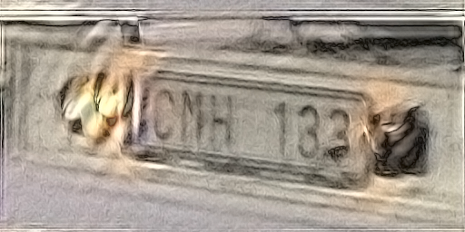

# Frequency Tools

*Copyright (c) 2012 Robert Kooima.  All Rights Reserved.*

This is a set of simple command line tools for performing 2D Fourier analysis and synthesis, plus basic arithmetic operations on 2D images. These tools use a strictly-defined subset of the TIFF image format as data representation. The selection of this TIFF subset, and the design of each tool work to maximize scalability. As such, all processes work out-of-core, and there is no built-in limit to the size of an input. Fine-grained multithreading is provided by OpenMP. Input sizes of several gigapixels are straightforwardly handled.

The tools include:

-	`fourier [-itrB] [-N norm] input.tif output.tif`

	One-dimensional Fourier transform and inverse with optional transpose. By default, `fourier` performs a 1D FFT on each *row* of `input.tif`, giving `output.tif`. With the transpose option `-t`, it performs a 1D FFT on each *column*. A 2D FFT requires two steps, a 1D FFT of the rows followed by a 1D FFT of the columns, using a temporary TIFF image to store the intermediate output.

		-t         Transposed column-wise transform
		-i         Inverse transform
		-r         Real output only, discarding phase
		-N norm    Normalization parameter
		-B         BigTIFF output

-	`compute [-asmdB] [-L linear] [-W wiener] op1.tif op2.tif result.tif`

	Arithmetic operations on 2D complex-valued images.

		-a         Add
		-s         Subtract
		-m         Multiply
		-d         Divide
		-L linear  Linear interpolation
		-W wiener  Wiener deconvolution
		-B         BigTIFF output

The TIFF image subset and its rationale is as follows:

-	*Image sizes are powers of two.*

	This restriction admits the use of the efficient and well-known radix-2 discrete Fourier transform of Cooley and Tukey.

-	*Data is stored with a tile-oriented layout.*

	Tile-orientated layout enables out-of-core execution of all phases of the 2D Fourier transform, as well as all supporting processes. This is critical for multi-gigapixel inputs.

-	*Tiles are square.*

	This allows straightforward transposition of individual tiles, which is a necessary intermediate phase of the out-of-core 2D Fourier transform.

-	*Tile sizes are powers of two.*

	Combined with the restriction that image sizes are powers of two, this ensures that no partially-filled tiles are ever necessary and that "wrap-around" works as expected.

-	*Samples are 32-bit IEEE floating point.*

	32-bit float support is necessary to ensure precision in the output, and uniform use of a single sample format simplifies all I/O code.

-	*Sample planar configuration is contiguous.*

	This is the most common configuration, and it's useful to pick only one and stick with it.

-	*Pixels are 1 or 2 samples with photometric interpretation 1.*  
	*Pixels are 3 or 6 samples with photometric interpretation 2 or 6.*

	This allows for the representation of both real and complex sample values giving monochrome, RGB, or YCbCr. Storing complex values as separate channels allows them to be separately operated upon using common image manipulation tools, including Photoshop. Allowing only 1 or 3 samples per pixel allows us to assume that an odd number of channels implies a real input and an even number of channels implies a complex input.

-	*Complex values are polar.*

	With explicitly represented amplitude, complex samples are directly downward compatible to real. This also admits a natural representation of complex samples using strictly non-negative values.

-	*All amplitude channels appear before all phase channels.*

	By front-loading the amplitude, a complex valued multi-channel image is downward compatible to a normal RGB image, and will appear as such when viewed using common image viewers.

-	*TIFF and BigTIFF are both valid.*

	BigTIFF is necessary when dealing with files larger than 4GB. However, Photoshop (as of CS6) does not fully support BigTIFF, so original TIFF is allowed for compatibility.

## Example: Image Deconvolution

In November of 2011 a [question][] was posed to [Ask Metafilter][askme] asking readers to help interpret a blury photograph of the number plate on a passing truck. The posting user, "[gentle][]" from Oslo, was tight-lipped about why this information was needed, but helpful-as-ever AskMe went to work anyway. Eventually, a user named "[trevyn][]" of San Francisco would [answer][] the question in spectacular fashion, having applied [Mathematica][]'s image deconvolution capabilities to determine the number beyond the shadow of any doubt. 

In this example, we'll use the `frequency` tools to reproduce trevyn's result and read the plate. [This][original] is the original image. As of this writing, the question, the answer, the image, and its decovolution all remain publicly accessible on Ask Metafilter. gentle's question has 36 favorites and trevyn's answer has 302 (which is *a lot*), with many subsequent posters astonished at the capability of image deconvolution. Many people learned what deconvolution was that day, and the thread is a great piece of AskMe. However, gentle never did follow up as to the reason for the question or the utility of the answer. For all I know, it may be sensitive. I am rehosting the original image here, and if gentle has a problem then he may contact me to remove it.

[askme]:       http://ask.metafilter.com/
[question]:    http://ask.metafilter.com/201542/Can-you-read-this-number-plate
[answer]:      http://ask.metafilter.com/201542/Can-you-read-this-number-plate#2902934
[gentle]:      http://www.metafilter.com/user/14169
[trevyn]:      http://www.metafilter.com/user/23824
[mathematica]: http://www.wolfram.com/mathematica/
[original]:    original.jpg

### Getting to the point

For starters, I cropped the image down to power-of-two size, which admits a really nice, efficient implementation of the Fast Fourier Transform. I made a point of *not* scaling the image so as to preserve the precise character of the noise in it. I suspect that trevyn may have denoised the image before deconvolving it. This is a smart thing to do, and I'll demonstrate it toward the end of this example, but for now I'll keep the exercise pure. Here's the cropped input, which I'll call `truck.tif`.

Initial Ask Metafilter responders had varied inputs: RNN 133, DNH 133, 123, QNN, 188, QNH, PNH, 163, CNM 733, PNW, DMR, 155, it was all over the map. But here's the image after deconvolution.

It's still a mess, but the numbers are quite clearly legible: CMH 133.

### Preparation

To begin, I used Photoshop to convert the image to 32-bit floating point and save it as an interleaved TIFF, as required by `frequency`. All images shown here are 32-bit floating point TIFF converted to 8-bit PNG for display on the web.

Look closely at the input image, to the right of the number plate there is a little orange smudge. This is the blur of a small lightsource, probably a hole in the shroud covering the lamp that illuminates the number plate. This blur has a clear shape that indicates the motion of the photographer's hand during the 1/24th of a second that the shutter was open. Every pixel in this image has been impacted by this same motion, and it's the reason why the number plate is note clearly legible. So, to read the number plate, we must undo that motion.

Here is the isolated path, which we call the *blur kernel*, `blur.tif`. I've converted it to gray because, despite the fact that the path appears orange in the input, all three channels red, green, and blue underwent the same blur during exposure, and we want them all to receive the same correction.

The process of blur removal, known as *deconvolution*, happens in the frequency domain, so we take the Fourier transform of the number plate as follows. Recall that a 2D Fourier transform is simply two 1D Fourier transforms, with the second of the two done in transpose. Because there are two, a temporary intermediate file `tmp.tif` is needed.

	fourier truck.tif tmp.tif
	fourier -t tmp.tif truckF.tif

Here are the frequency domain amplitude channels of `truckF.tif`. The `fourier` tool will output six total channels, three of amplitude and three of phase, but the amplitude is really the more interesting.

Likewise, the blur kernel must also be transformed into the frequency domain. However, if our goal is to make a round trip from spatial domain, to frequency domain, and back to spatial domain, then any convolution kernel that we apply in the frequency domain must have *unit energy*. All of its pixels have to sum to one, and if that's not the case then the output image will not have the same brightness as the input.

The process of scaling a blur kernel to unit energy is called *normalization*, and Photoshop's Analysis tools make it easy. Select the entire blur kernel image and invoke Record Measurements. In the Measurement Log, under the column labeled Integrated Density, we see the sum of all pixels in this image: 40.57. If we scale the entire image by a factor of 1/40.57 then the sum of all its pixels will be 1.0. The `fourier` tool can do this, so armed with this value, we compute the *normalized* Fourier transform of the blur kernel.

	fourier -N 40.57 blur.tif tmp.tif
	fourier -t tmp.tif blurF.tif

The resulting amplitudes in `blurF.tif` look like this.

### Deconvolution

Blur is convolution. Convolution is multiplication in the frequenty domain. If we magically had a perfectly unblurred image of the truck `perfect.tif` and we computed its frequency domain representation `perfectF.tif` then multiplication by `blurF.tif` would produce our input `truckF.tif`. Inverse Fourier transform of this would give `truck.tif` the image that gentle posted to Ask Metafilter.

Of course we don't have `perfect.tif` and we don't want `truck.tif`, we want to do the exact opposite. No problem, the opposite of multiplication is division, so we should be able to extract `perfect.tif` from `truck.tif` by dividing in the frequency domain instead of multiplying. In an ideal world, this would indeed work! To try it, compute the division as follows

	compute -d truckF.tif blurF.tif divideF.tif

Then convert the frequency domain division to the spatial domain using the inverse Fourier transform.

	fourier -i   divideF.tif tmp.tif
	fourier -itr tmp.tif divide.tif

Unfortunately, gentle's iPhone 4 has a pinhole lens and a tiny sensor and the resulting image noise is amplified by the division in the frequency domain, giving this:

That is not a step forward. Looking again at `blurF.tif`, above, note that there are areas of black. These are low-energy spectra in the blur kernel. Black is represented by very small values, and dividing by a very small value results in a very large value. The resulting high-energy spectra overpower the relatively low-energy signal that the deconvolution has produced, and the final spatial-domain image is useless.

### Tuning

Fortunately, there's a solution in what's known as [Wiener deconvolution][wiener], a reformulation of the division operation to ensure that the result remains stable in the presense of small values in the frequency domain representation of the blur kernel. This reformulation provides a parameter that allows us to balance noise against deblurring. There are ways of choosing a good value for this parameter, but to keep it simple we'll go with trial and error.

[wiener]: http://en.wikipedia.org/wiki/Wiener_deconvolution

Let's try a Wiener deconvolution with a parameter of 0.5 and do an inverse Fourier transform on the result.

	compute -W 0.5 truckF.tif blurF.tif wienerF.tif
	fourier -i   wienerF.tif tmp.tif
	fourier -itr tmp.tif wiener.tif

Here's the output:

The noise has been reduced, but the image isn't any more clear. Here it is at 0.1:

It's more legible, but still a bit blurry. Let's go a little further, to 0.05:

Now we've got some sharpness in the lettering. That's good. The noise has returned, but again, we're trying to strike a balance. Let's keep reducing the Wiener parameter, this time to 0.01.

Well that's excellent sharpness in the number plate, but the noise is a little much. Just for the hell of it, lets see what happens if we keep going... 0.001.

That's too far. Any further and it's going to resemble the useless output of the division operator. Indeed, that's what the Wiener parameter does: it allows for a point to be selected somewhere between the completely untouched image and the completely destroyed image. I think 0.05 strikes a good balance, and that's the value used to produce the output shown at the start of this example.

### Conclusions

We can do a teensy bit better by denoising the original input image. This is a perfectly reasonable thing to do, as the noise characteristics of digital cameras are well-understood by the image enhancement algorithms provided by common photo processing applications. To demonstrate, I've applied Photoshop's Reduce Noise filter before performing a Wiener deconvolution with a parameter of 0.01.

That's clearly the best. But why isn't the best output even better? Why, for example, has the little orange smudge *not* been collapsed back down to a single orange dot through the marvelous process of image deconvolution? Fundamentally, because my blur kernel is imperfect. It's too wide, it has holes... it's the result of 5 minutes of fiddling with levels in Photoshop. But even if I had labored to produce an ideal extraction of the orange smudge, this still wouldn't take into account every single factor that impacted the quality of the exposure. We would need to know everything about the camera, the lens, and the sensor noise, and we'd also need a perfect understanding of the motion of both vehicles and the photographer. It's impossible, and fortunately for gentle, it's not necessary.

Perfect image deconvolution *is* possible under artificial conditions. Create an arbitrary blur kernel using your favorate image editor and convolve it with an image by computing the frequency domain multiplication. Take a moment to appreciate your beautifully screwed-up image. Then deconvolve that same image by computing the frequency domain division. You will get the original image back, with mathematical equality. This proves the point. Regardless, this simple, imperfect number plate example is probably already closer to CSI-grade fantasy than you may have thought possible.
