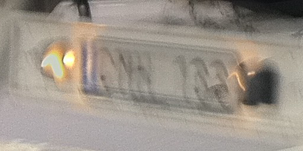
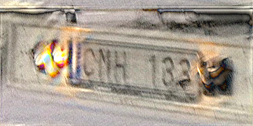
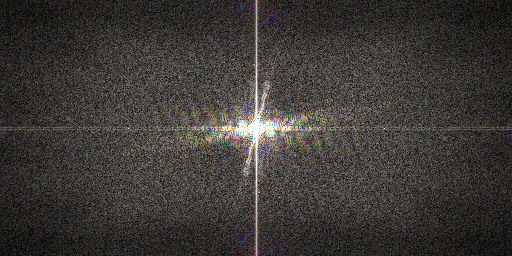
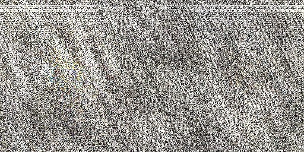
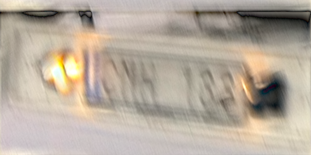
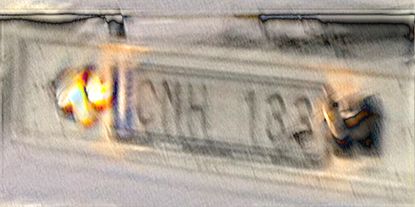
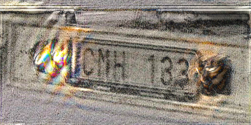
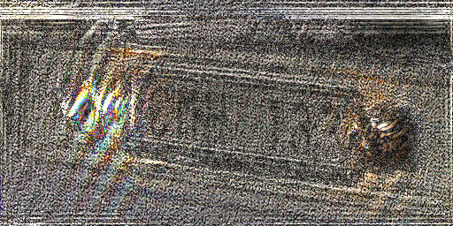

## Example: Image Deconvolution

In November of 2011 a [question][] was posed to [Ask Metafilter][askme] asking readers to help interpret a blury photograph of the number plate on a passing truck. The posting user, "[gentle][]" from Oslo, was tight-lipped about why this information was needed, but helpful-as-ever AskMe went to work anyway. Eventually, a user named "[trevyn][]" of San Francisco would [answer][] the question in spectacular fashion, having applied [Mathematica][]'s image deconvolution capabilities to determine the number beyond the shadow of any doubt. 

[This][original] is the original image. In this example, we'll use the `frequency` tools to reproduce trevyn's result and read the plate. As of this writing, the question, the answer, the image, and its decovolution all remain publicly accessible on Ask Metafilter. gentle's question has 36 favorites and trevyn's answer has 302 (which is *a lot*), with many subsequent posters astonished at the capability of image deconvolution. Many people learned what deconvolution was that day, and the thread is a great piece of AskMe. That said, gentle never did follow up as to the reason for the question or the utility of the answer. For all I know, it may be sensitive. I am rehosting the original image here, and if gentle has a problem then he may contact me to remove it.

[askme]:       http://ask.metafilter.com/
[question]:    http://ask.metafilter.com/201542/Can-you-read-this-number-plate
[answer]:      http://ask.metafilter.com/201542/Can-you-read-this-number-plate#2902934
[gentle]:      http://www.metafilter.com/user/14169
[trevyn]:      http://www.metafilter.com/user/23824
[mathematica]: http://www.wolfram.com/mathematica/
[original]:    original.jpg

### Getting to the point

For starters, I cropped the image down to power-of-two size, which admits a really nice, efficient implementation of the Fast Fourier Transform. I made a point of *not* scaling the image so as to preserve the precise character of the noise in it. I suspect that trevyn may have denoised the image before deconvolving it, which is not a foul play, but in this example I'll keep the exercise pure. Here's the cropped input, which I'll call `truck.tif`.

Initial Ask Metafilter responders had varied inputs: RNN 133, DNH 133, 123, QNN, 188, QNH, PNH, 163, CNM 733, PNW, DMR, 155, it was all over the map. But here's the image after deconvolution.

It's still a mess, but the numbers are quite clearly legible: CMH 133.

### Preparation

To begin, I used Photoshop to convert the image to 32-bit floating point and save it as an interleaved TIFF, as required by `frequency`. All images shown here are 32-bit floats knocked down to 8-bit for display on the web.

Look closely at the input image, to the right of the number plate. There we see the blur of a small orange lightsource, probably a hole in the shroud covering the lamp that illuminates the number plate. This blur has a clear shape that indicates the shake of the photographers hand (and the truck's motion, and the car's motion) during the 1/24th of a second that the shutter was open. Every pixel in this image is the product of this same motion, and it's the reason why the number plate is note clearly legible. So, to read the number plate, we must undo that motion.

Here is the isolated path, which we call the blur kernel, `blur.tif`. I've converted it to gray because, despite the fact that the path appears orange in the input, all three channels red, green, and blue underwent the same blur during exposure, and we want them all to receive the same correction.

Deconvolution happens in the frequency domain, so we take the Fourier transform of the number plate as follows. Recall that a 2D Fourier transform is simply two 1D Fourier transforms, with the second of the two done in transpose. Because there are two, a temporary intermediate file is needed.

	fourier truck.tif tmp.tif
	fourier -t tmp.tif truckF.tif

Here are the frequency domain amplitude channels of `truckF.tif`. The `fourier` tool will output six total channels, three of amplitude and three of phase, but the amplitude is really the more interesting.

Likewise, the blur kernel must also be transformed into the frequency domain. However, if our goal is to make a round trip from spatial domain, to frequency domain, and back to spatial domain, then any convolution kernel that we apply in the frequency domain must have unit energy. All of its pixels have to sum to one, and if that's not the case then the output image will not have the same brightness as the input. Photoshop's Analysis tools make this easy. Select the entire blur kernel image and invoke Record Measurements. In the Measurement Log, in the column labeled Integrated Density, we see the sum of all pixels in this image: 40.56932. Armed with this value, we compute the *normalized* Fourier transform of the blur kernel.

	fourier -N40.56932 blur.tif tmp.tif
	fourier -t tmp.tif blurF.tif

The resulting amplitudes in `blurF.tif` look like this.

### Deconvolution

Blur is convolution. Convolution is multiplication in the frequenty domain. So if we magically had a perfectly unblurred image `perfect.tif` and we computed its frequency domain representation `perfectF.tif` then multiplication by `blurF.tif` would produce our input `truckF.tif`. Inverse Fourier transform of this would give `truck.tif` the image that gentle posted to Ask Metafilter.

Of course we don't have `perfect.tif` and we don't want `truck.tif`, we want to do the exact opposite. No problem, the opposite of multiplication is division, so we should be able to extract `perfect.tif` from `truck.tif` by dividing in the frequency domain instead of multiplying. In an ideal world, this does indeed work! To try it, compute the division as follows

	compute -d truckF.tif blurF.tif divideF.tif

Then convert the frequency domain division to the spatial domain using the inverse Fourier transform.

	fourier -i   divideF.tif tmp.tif
	fourier -itr tmp.tif divide.tif

Unfortunately, gentle's iPhone 4 has a pinhole lens and a tiny sensor and the resulting image noise is amplified by the frequency domain division, giving this:

That is not a step forward. Looking again at `blurF.tif`, above, note that there are areas of black. These represent low-energy spectra in the blur kernel. Black is zero, and division by zero results in crap. The inverse Fourier transform of crap is useless.

### Tuning

Fortunately, there's a solution in what's known as [Wiener deconvolution][wiener]. Most discussions of Wiener deconvolution are difficult to get through, but it's really just a reformulation of the division operation to ensure that it remains stable in the presense of blackness in the frequency domain representation of the blur kernel. This reformulation provides a parameter that allows us to balance noise against deblurring. Choosing a good value for this parameter is, far all intents and purposes, a process of trial and error.

Let's try a Wiener deconvolution with a parameter of 0.5 and do an inverse Fourier transform on the result.

	compute -W0.5 truckF.tif blurF.tif wienerF.tif
	fourier -i   wienerF.tif tmp.tif
	fourier -itr tmp.tif wiener.tif

Here's the output:

The noise has been reduced, but the image isn't any more clear. Here it is at 0.1:

Not bad! It's legible, but still a bit blurry. Let's go a little further, to 0.05:

Now we've got some sharpness in the lettering. That's good. The noise has returned, but again, we're trying to strike a balance. Let's keep reducing the Wiener parameter, this time to 0.01.

Well that's excellent sharpness in the number plate, but the noise is a little much. Just for the hell of it, lets see what happens if we keep going... 0.001.

That's too far. Any further and it's going to resemble the useless output of the division operator. Indeed, that's what the Wiener parameter does: it allows for a point to be selected somewhere between the completely untouched image and the completely destroyed image. I think 0.05 strikes a good balance, and that's the value used to produce the output shown at the start of this example.

[wiener]: http://en.wikipedia.org/wiki/Wiener_deconvolution
